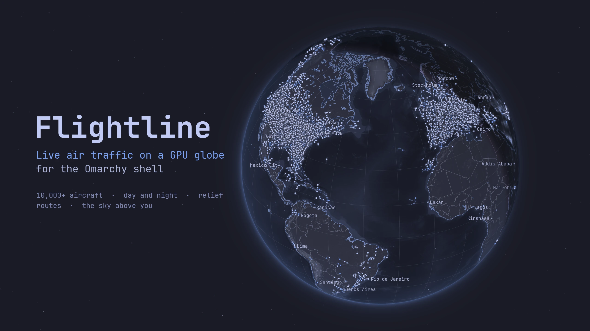

# Flightline

[](https://github.com/pedroolivy/omarchy-flightline/actions/workflows/ci.yml)



The whole world's air traffic on a GPU globe, right in the Omarchy bar.

A small plane in the bar counts the aircraft flying near you. Click it and a
globe opens in your theme's colours with every aircraft the community
receivers hear, around 9,000 at once.

## Features

- **Bar pill** with the aircraft near you; an emergency squawk nearby takes it over.
- **A real globe on the GPU:** relief, sea depth, borders, the live sun and
  city lights at night, in your theme's colours (dark, light or warm).
- **Smooth traffic:** positions are dead-reckoned on the GPU between updates,
  with trails and altitude shadows when you zoom in.
- **Aircraft card:** airline, type, route with an estimated landing time,
  altitude, speed and squawk, and the route drawn on the globe.
- **Find any flight** by callsign, flight number, registration or hex, and follow it.
- **Look up:** the sky above you, with aircraft, the Sun, the Moon and the planets.
- **Light:** nothing is drawn while nothing moves; the closed panel costs
  one small request a minute.

## Install

```bash
omarchy plugin add https://github.com/pedroolivy/omarchy-flightline.git --enable
```

The pill appears on the right of the bar. To open the globe from a key, add to
`~/.config/hypr/bindings.lua`:

```lua
o.bind("SUPER + ALT + F", "Flightline", "omarchy-shell shell toggle io.github.pedroolivy.flightline")
```

## Remove

```bash
omarchy plugin remove io.github.pedroolivy.flightline
```

This removes the plugin and its bar entry. The only other files live in
`$XDG_RUNTIME_DIR` (in memory) and are gone at logout.

## Using it

| Input | Action |
|-------|--------|
| Drag / scroll / double-click | Spin / zoom / zoom in |
| Click a plane | Details and route |
| `/` | Find a city or a flight |
| `F` | Follow the selected aircraft |
| `N` / `E` | Next aircraft / next emergency |
| `C` / `W` | Your location / the whole world |
| `1` / `2` | Globe / Look up |
| `Esc` | Stop following → deselect → close |

**Location:** a city you set in the panel, else your Omarchy weather location,
else an estimate from your IP. An experimental Wi-Fi lookup runs only when
you press its button.

## Settings

```bash
omarchy bar set io.github.pedroolivy.flightline units aviation
```

| Key | Default | Meaning |
|-----|---------|---------|
| `nearbyRadiusNm` | `100` | Radius of the bar count, in nautical miles (5–250) |
| `units` | `auto` | `metric`, `imperial`, `aviation` or `auto` |
| `feedSource` | `adsb.lol` | `adsb.lol` or `adsb.fi`; the other takes over on failure |
| `wideQueries` | `true` | Let adsb.lol answer circles wider than its documented 250 nm (needed for the world view) |
| `showLabels`, `showGraticule`, `showNight`, `showLights`, `showRelief`, `showTrails`, `showStars` | `true` | Globe layers |

Scripting: `omarchy-shell flightline status | track <flight> | view <lat,lon,nm> | world | snapshot`.

## Data and privacy

Positions come from community ADS-B networks ([adsb.lol](https://adsb.lol)
and [adsb.fi](https://adsb.fi)), so coverage is thin in some regions. Flightline
sends the area you look at to the feed (no location at all for the world
view), a callsign to [adsbdb](https://www.adsbdb.com) for routes, and your
searches to the geocoder. Nothing is stored beyond your `shell.json` entry and
two temporary files on tmpfs.

## Dependencies

All ship with Omarchy: `curl`, `jq`, `python3` (standard library), `timedatectl`
and, for the optional Wi-Fi lookup, `nmcli`. Shaders come prebuilt; no `sudo`.

## Development

How it works, file formats and performance budgets:
[docs/ARCHITECTURE.md](docs/ARCHITECTURE.md). Tests:

```bash
node tests/model.test.mjs && node tests/sky.test.mjs
python3 -m unittest discover -s tests/feed       # FLIGHTLINE_FIXTURES=dir adds saved real answers
python3 -m unittest discover -s tests/repo       # manifest, shaders, assets, shipped files
WORLD_JSON=world.json tests/offscreen/run.sh     # GPU renders, offscreen
```

CI runs all of these on every push, the renders on Arch Linux's Qt with Mesa's
software renderer.

## Credits

Aircraft: [adsb.lol](https://adsb.lol) ([ODbL](https://opendatacommons.org/licenses/odbl/1-0/))
and [adsb.fi](https://adsb.fi). Routes: [adsbdb](https://www.adsbdb.com), data by
David Taylor and Jim Mason. Map: Natural Earth. Relief: NOAA ETOPO1. Night
lights: NASA Black Marble. Sky: Jean Meeus' *Astronomical Algorithms*. Full
terms in [NOTICE.md](NOTICE.md).

## License

[MIT](LICENSE)
